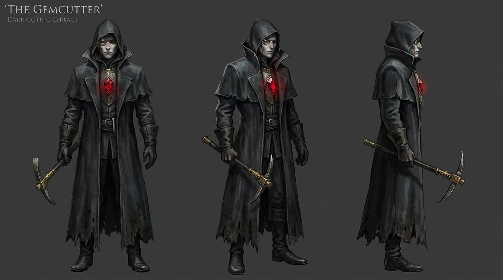

# BLOODGEM

*A 2.5D aerial-view souls-like in the spirit of Bloodborne. One bad night in a
mining city that drilled too deep.*



## Play

**▶ Play it now: https://andrescarreondiaz.github.io/bloodgem/**

Or locally:

```bash
npm install
npm run dev        # → http://localhost:5173
```

| Input | Action |
|---|---|
| WASD | move (W also mounts ladders) |
| Mouse | aim |
| LMB | strike — strike a **staggered** foe for a VISCERAL |
| RMB | Shardcaster — time it into an enemy wind-up to **parry** |
| Space / Shift | quickstep dash (i-frames, cancelled if you attack) |
| Q | transform the Seamsplitter (mid-combo = transform strike) |
| F / R | drink a Gemwater Phial |
| E | rest at lamps, open gates, ride lifts, reach into things you shouldn't |
| 1–4 | cut facets in the soul-gem menu |

## The night

Veinmouth grew rich mining **bloodgems** — crystals warm as flesh, whose light
heals. Tonight the Lapidarist Guild drills into the **Heartseam** itself, and
the gem-blessed begin to turn. You are a Gemcutter, paid in the only currency
that matters: a socket of your own.

Fight through **Ember Row** (chapel terrace, hunt-mob streets, the canal
underlayer, the Gallows Square) and descend **The Undervein** (the cargo lift,
the Gantry scaffolds, the flooded galleries) to the heart of the Marrowed King
— and choose what the city wakes to.

Three bosses. Two endings. Every lost fight is your fault.

## The feel (research-anchored)

Built from studying what makes Bloodborne *feel* like Bloodborne
(`docs/research/`): the **rally** system (lost health stays orange 5s — win it
back by attacking), an 11-frame front-loaded i-frame dash whose invulnerability
cancels if you attack out of it (Hades' rule), a gun-parry with a forgiveness
ladder (Unsighted), asymmetric hit-stop (Capcom's *The Punisher*: victim
freezes 2 frames longer), interconnected shortcut loops that click open
(Central Yharnam), lamp-refill phials instead of farmable vials (the one thing
Bloodborne got wrong), and death-to-retry under 2 seconds (Rubinite's lesson).

## Under the hood

- **Engine:** Vite + TypeScript + Canvas2D, no frameworks. Fixed 60Hz sim.
  True x/y/z entities (CrossCode's model): stairs are ramp regions with
  fractional z, ladders commit both hands, ledges are one-way drop-downs,
  elevators are moving ground, snipers aim in 3D across height tiers.
- **Art:** pixel sprites generated with `google/nano-banana-2` on Replicate —
  one painted character anchor locks identity, green-screen chroma-key gives
  transparency (`scripts/gen-image.mjs`), sharp trims + nearest-downscales
  (`scripts/prep-sprites.mjs`).
- **Audio:** every sound and track generated with ElevenLabs
  (`scripts/gen-audio.mjs`) — SFX one-shots, gapless ambience loops, and boss
  themes built from composition plans (the final boss theme's phase change is
  a plan chunk boundary).
- **Verification:** `scripts/dev-verify.mjs` drives the real game in headless
  Chromium — 62 assertions covering the whole souls kit, both levels, all
  four bosses, NPCs, secrets, and the ending — plus `scripts/audit-paths.mjs`,
  18 structural checks that BFS the collision model to prove every arena,
  lamp, and secret is honestly reachable on foot.
  `npm run build && npx vite preview --port 4199 &` then run both scripts.

Design bible: `docs/GDD.md`. Build log: `docs/ROADMAP.md`.

## Contributing (humans and agents)

The task board is [GitHub Issues](https://github.com/AndresCarreonDiaz/bloodgem/issues)
— start with the pinned issue, then read `docs/AGENTS.md` for the house rules
and the two verification suites that gate every change.
